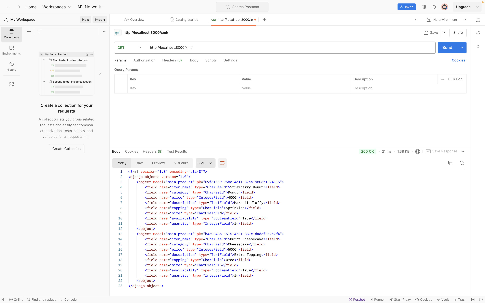

# Doughsy

Nama : Valiza Nadya Jatikansha

NPM : 2306240156

Kelas : PBP B

URL Doughsy : http://valiza-nadya-doughsy.pbp.cs.ui.ac.id 

- [Tugas 2](#tugas-2)
- [Tugas 3](#tugas-3)
- [Tugas 4](#tugas-4)
- [Tugas 5](#tugas-5)

## Tugas Individu 2 <a id="tugas-2"></a>

1. **Jelaskan bagaimana cara kamu mengimplementasikan checklist di atas secara step-by-step (bukan hanya sekadar mengikuti tutorial).**

1) **Membuat Repository dan Setup Environment**
  - Membuat repository dan direktori baru sesuai dengan nama proyek
  - Menghubungkan direktori lokal ke repository menggunakan perintah `git add remote <url repository>`
  - Mengaktifkan Virtual Environment menggunakan `python3 -m venv env`
  - Membuat berkas requirements, menambahkan, dan menginstal dependencies yang dibutuhkan


2) **Membuat Proyek Django**
  - Inisialisasi proyek baru menggunakan perintah `django-admin startproject projectname.`
  - Menambahkan host dari server yang diizinkan untuk mengakses aplikasi web pada `ALLOWED_HOSTS` pada `settings.py`
  - Buat aplikasi baru di dalam proyek menggunakan perintah `python manage.py startapp appname.`
  - Menambahkan aplikasi baru ke dalam daftar `INSTALLED_APPS` pada `settings.py`


3. **Konfigurasi Model Dasar Aplikasi (models.py)**
- Membuat model pada `models.py` di direktori aplikasi dengan mengidentifikasi kebutuhan aplikasi. Aplikasi Doughsy menggunakan model seperti berikut ini, 
```
from django.db import models

class Product(models.Model):
name = models.CharField(max_length=100)
price = models.DecimalField(max_digits=10, decimal_places=2)
description = models.TextField()

def __str__(self):
   return self.name

class Donut(models.Model):
flavor = models.CharField(max_length=50) 
size = models.CharField(max_length=10)   
availability = models.BooleanField(default=True)

def __str__(self):
   return f"{self.flavor} ({self.size})"
```
- Melakukan migrasi model setiap ada perubahan data menggunakan perintah `python manage.py makemigrations` dan `python manage.py migrate` untuk migrasi ke database lokal 


4. **Mendefinisikan view pada `views.py` dan template HTML**
- Implementasikan function view pada `views.py` sesuai dengan kebutuhan fitur aplikasi
- Buat berkas template (HTML) untuk menampilkan data dari views menggunakan struktur kode Django. Berikut kode yang saya implementasikan pada aplikasi Doughsy,
```
<h1>{{ appName }}</h1>

<h5>NPM: </h5>
<p>{{ npm }}<p>
<h5>Name: </h5>
<p>{{ name }}<p>
<h5>Class: </h5>
<p>{{ class }}<p>
```

5. **Konfigurasi URL aplikasi dan URL proyek**
- Membuat berkas `urls.py` pada direktori aplikasi dan menambahkan URL routing untuk menghubung view dengan URL
  ```
  from django.urls import path
  from main.views import show_main
  
  app_name = 'main'
  
  urlpatterns = [
  path('', show_main, name='show_main'),
  ]
  ```
- Memodifikasi berkas `urls.py` pada direktori proyek dengan menambahkan rute URL yang mengarah ke tampilan aplikasi
  ```
  urlpatterns = [
  ...
  path('', include('main.urls')),
  ...
  ]
  ```
      
6. **Deployment and testing**
- Menjalankan proyek Django menggunakan perintah `python manage.py runserver`
- Melakukan deploy aplikasi ke platform hosting (Pacil Web Service (PWS))
- Melakukan testing dengan memodifikasi `tests.py` dan menjalankan perintah `python manage.py test`

2. **Buatlah bagan yang berisi request client ke web aplikasi berbasis Django beserta responnya dan jelaskan pada bagan tersebut kaitan antara urls.py, views.py, models.py, dan berkas html.** 
    ``` mermaid 
    flowchart LR
    A[Client] --> B[urls.py]
    B --> C[views.py]
    C --> D[models.py]
    C --> E[Template HTML]
    D --> C
    E --> F[Response HTML]
    F --> A[Client]
    
    subgraph Django Request-Response Flow
        C[views.py] --> |"Process and pass data to the HTML template"| E
        E[Template HTML] --> |"Return a view with the processed data"| F
    end
    ```

- **Client**: Pengguna atau klien mengirimkan permintaan dari browser mereka, yang kemudian diterima oleh aplikasi Django.
- **urls.py**: Berfungsi untuk mencocokkan URL yang diminta dengan view yang relevan di views.py. Dengan kata lain, setiap URL yang diminta diarahkan ke logika tertentu di aplikasi.
- **views.py**: Mengelola logika utama dari aplikasi yang apat melibatkan pengambilan data dari models.py (jika ada interaksi dengan database) dan kemudian memproses data tersebut untuk diserahkan ke template.
- **models.py**: Jika diperlukan, views.py mengambil data dari database melalui models.py, yang merupakan representasi dari tabel-tabel dalam database
- **Template HTML**: Setelah views.py menyelesaikan pemrosesan data, data tersebut diberikan kepada template HTML yang menghasilkan halaman web dinamis berdasarkan informasi yang dikumpulkan.
- **Response HTML**: Template HTML yang sudah dirender dikirim kembali sebagai respon ke klien untuk ditampilkan di browser.

3. **Jelaskan fungsi git dalam pengembangan perangkat lunak!**

   Git adalah sistem kontrol versi yang digunakan untuk melacak semua perubahan yang telah dibuat pada kode dalam sebuah proyek, sehingga kita dapat melihat perubahan apa saja yang sudah dilakukan pada kode dari waktu ke waktu. Git juga mendukung kolaborasi, yang memungkinkan banyak pengembang bekerja secara bersamaan pada proyek yang sama tanpa risiko merusak kode satu sama lain. Selain itu, Git juga menyediakan fitur branching dan merging, di mana pengembang dapat membuat cabang terpisah untuk bekerja pada fitur baru atau memperbaiki bug, dan kemudian menggabungkannya kembali ke cabang utama setelah pekerjaan selesai.

4. **Menurut Anda, dari semua framework yang ada, mengapa framework Django dijadikan permulaan pembelajaran pengembangan perangkat lunak?**

Django sering digunakan sebagai framework awal untuk belajar pengembangan perangkat lunak karena beberapa hal berikut,
- **Open sources**: Django adalah framework open source, artinya dapat digunakan dan dimodifikasi oleh siapa saja tanpa biaya.
- **Skalabilitas**: Django dapat digunakan untuk proyek skala kecil maupun skala besar, sehingga framework ini masih relevan untuk proyek yang lebih besar di masa depan, tanpa perlu beralih ke framework lain yang lebih kompleks.
- **Keamanan**: Django memiliki fitur keamanan yang kuat secara bawaan, seperti perlindungan dari serangan umum (SQL injection, XSS, CSRF). 
- **Fitur Bawaan yang Lengkap**: Django menyediakan berbagai fitur bawaan seperti ORM (Object-Relational Mapping), manajemen pengguna, autentikasi, dan sistem template. 
- **Komunitas**: Django memiliki komunitas besar yang aktif, hal ini membuat proses pembelajaran lebih mudah karena pengembang pemula dapat menemukan tutorial, panduan, serta solusi untuk masalah yang mereka hadapi dengan cepat.

5. **Mengapa model pada Django disebut sebagai ORM?**

   Model pada Django disebut ORM (Object-Relational Mapping) karena Django menggunakan ORM untuk memetakan objek Python ke dalam tabel database. Dengan ORM, pengembang  tidak perlu menulis query SQL manual untuk mengakses atau menyimpan data di database. Cukup dengan menggunakan gunakan objek Python untuk mengelola data.

Referensi : https://medium.com/@yc.yugesh/django-web-development-framework-3a9edcd6e4a

## Tugas Individu 3 <a id="tugas-3"></a>

1. **Jelaskan mengapa kita memerlukan data delivery dalam pengimplementasian sebuah platform?**

    Pentingnya data delivery dalam pengimplementasian sebuah platform antara lain:
    - **Pertukaran Informasi Efisien**: Memastikan komunikasi yang lancar antara server dan klien, sehingga aplikasi tetap responsif tanpa perlu memuat ulang halaman.
    - **Ketersediaan Informasi Real-Time**: Memberikan data yang selalu akurat, penting untuk platform seperti e-commerce atau sistem keuangan.
    - **Integrasi Sistem**: Menghubungkan berbagai komponen platform untuk bekerja secara sinergis.
    - **Pengambilan Keputusan Berbasis Data**: Mendukung analisis data dan pengambilan keputusan yang lebih baik.
    - **Skalabilitas dan Kestabilan**: Menjamin kinerja yang stabil meski jumlah pengguna meningkat.
    - **Keamanan dan Privasi Data**: Melindungi data melalui enkripsi dan protokol keamanan.
    - **Optimalisasi Sumber Daya**: Mengurangi biaya operasional dengan memanfaatkan sumber daya secara efisien.

2. **Menurutmu, mana yang lebih baik antara XML dan JSON? Mengapa JSON lebih populer dibandingkan XML?**

    JSON lebih sering dianggap lebih baik daripada XML karena lebih ringan, mudah dibaca, dan ditulis oleh manusia. JSON memiliki struktur sederhana berupa pasangan key-value, sehingga lebih mudah diproses oleh banyak bahasa pemrograman, terutama JavaScript. XML memang memiliki kelebihan dalam mendeskripsikan data kompleks dengan dukungan struktur hierarki dan atribut, serta menawarkan skema standar seperti XSD untuk validasi data. Namun, XML sering kali terasa lebih rumit dan verbose.
    
    Keuntungan utama JSON meliputi kesederhanaan, keterbacaan, integrasi erat dengan JavaScript, parsing yang lebih cepat, dan ukuran file yang lebih kecil. Hal ini membuat JSON lebih efisien untuk transmisi data di jaringan. Meskipun XML masih relevan untuk kebutuhan tertentu seperti validasi skema, JSON menjadi lebih populer dalam pengembangan web modern karena kesederhanaan dan kinerjanya yang lebih baik.

5. **Jelaskan fungsi dari method is_valid() pada form Django dan mengapa kita membutuhkan method tersebut?**
   
    Method `is_valid()` pada Django digunakan untuk memeriksa apakah data yang dimasukkan melalui form sudah sesuai dengan aturan yang telah ditentukan, seperti memastikan bahwa semua kolom wajib telah diisi dan sesuai dengan tipe data atau format yang diharapkan. Fungsi utama `is_valid()` adalah melakukan validasi data yang dikirim melalui form, memeriksa apakah semua field memenuhi aturan validasi yang ditentukan dalam model form atau melalui validasi khusus. Jika data valid, method ini akan mengembalikan nilai `True`; jika tidak, akan mengembalikan `False` dan menyimpan pesan kesalahan terkait field yang tidak valid dalam atribut `form.errors`. Ini memungkinkan pengembang untuk dengan mudah menampilkan pesan kesalahan kembali kepada pengguna. Selain itu, `is_valid()` juga memicu metode `clean()`, yang membersihkan dan menormalkan data form, memastikan bahwa data berada dalam format yang dapat digunakan sebelum diproses atau disimpan ke database. 
    
    `is_valid()` sangat penting karena beberapa alasan. Pertama, ini menjaga integritas data dalam aplikasi dengan memastikan hanya data yang valid dan bersih yang akan diproses, mencegah kesalahan, kerentanan keamanan, atau gangguan fungsi yang disebabkan oleh data yang tidak valid atau rusak. Kedua, `is_valid()` memungkinkan pengembang untuk memberikan umpan balik kepada pengguna ketika mereka mengirimkan data yang salah atau tidak lengkap. Dengan menyediakan pesan kesalahan, pengguna dapat mengidentifikasi dan memperbaiki masalah sebelum mengirim ulang data. Ketiga, method ini mencegah penyimpanan data yang tidak valid ke dalam database, menjaga konsistensi dan keandalan data dengan memastikan hanya data yang benar yang disimpan. Terakhir, Django menyediakan validasi form bawaan, seperti pemeriksaan field wajib dan tipe data, membuat `is_valid()` menjadi alat yang efisien dan otomatis untuk menangani validasi, sehingga memudahkan pengembang dalam memastikan bahwa aplikasi bekerja sesuai dengan yang diharapkan.

4. **Mengapa kita membutuhkan csrf_token saat membuat form di Django? Apa yang dapat terjadi jika kita tidak menambahkan csrf_token pada form Django? Bagaimana hal tersebut dapat dimanfaatkan oleh penyerang?**
   
    `csrf_token` diperlukan saat membuat form di Django untuk melindungi aplikasi dari serangan Cross-Site Request Forgery (CSRF).  CSRF adalah jenis serangan di mana penyerang mengeksploitasi akses pengguna untuk melakukan aksi yang tidak diinginkan tanpa sepengetahuan mereka. Tanpa `csrf_token`, aplikasi menjadi rentan karena penyerang dapat membuat permintaan berbahaya yang tampak sah dari pengguna yang sedang login. 
    
    Jika kita tidak menambahkan `csrf_token` pada form Django, penyerang dapat membuat situs web atau skrip yang mengirimkan permintaan HTTP ke server aplikasi atas nama pengguna yang sedang login. Contohnya, penyerang dapat mengarahkan pengguna ke halaman jahat yang secara otomatis mengirimkan formulir tanpa sepengetahuan pengguna, memanfaatkan cookie sesi pengguna untuk mengelabui server agar percaya bahwa permintaan tersebut sah. Hal ini dapat mengakibatkan berbagai tindakan berbahaya, seperti pengubahan data sensitif, pelaksanaan transaksi, atau pencurian data pribadi.
    
    `csrf_token` bekerja dengan menambahkan token unik ke setiap form yang dikirim ke server. Token ini kemudian diverifikasi oleh server untuk memastikan bahwa permintaan tersebut berasal dari sumber yang sah, yaitu dari form yang dihasilkan oleh aplikasi itu sendiri. Dengan cara ini, `csrf_token` mencegah penyerang membuat permintaan palsu atas nama pengguna yang sedang login, karena mereka tidak akan memiliki token yang valid untuk disertakan dalam permintaan.

6. **Jelaskan bagaimana cara kamu mengimplementasikan checklist di atas secara step-by-step (bukan hanya sekadar mengikuti tutorial).**

  1) **Membuat Direktori Templates**: Membuat direktori `templates` di direktori utama yang berisi file `base.html`.
  2) **Membuat Form:** Pertama, membuat `ProductForm` pada file `forms.py` di direktori 'main'. Form ini akan digunakan untuk menambahkan data produk baru.
  3) **Menambahkan View untuk Form:** Membuat function `create_product_entry` pada `views.py`. Function ini menangani input dari form dan menyimpan data ke database jika form valid.
  4) **Menambahkan Template:** Membuat atau perbarui file HTML (`create_product_entry.html`) yang berisi form input sehingga pengguna dapat memasukkan data produk.
  5) **Membuat 4 View Data Delivery:** Menambahkan 4 fungsi view di `views.py` untuk menampilkan data produk dalam format XML dan JSON, baik secara keseluruhan maupun berdasarkan ID.
  6) **Menambahkan URL Routing:** Menambahkan URL routing di `urls.py` untuk menghubungkan setiap view yang telah dibuat sehingga dapat diakses melalui URL tertentu.

**Hasil Akses URL pada Postman**

**XML**


**JSON**


**XML by ID**


**JSON by ID**


Referensi: https://portswigger.net/web-security/csrf

## Tugas Individu 4 <a id="tugas-4"></a>

1. **Apa perbedaan antara HttpResponseRedirect() dan redirect()**

  `HttpResponseRedirect()` adalah metode yang lebih manual untuk mengarahkan pengguna ke URL tertentu, di mana URL harus disebutkan secara lengkap di dalam tanda kutip, seperti `return HttpResponseRedirect('/login/')`. Sedangkan, `redirect()` menawarkan cara yang lebih praktis dan fleksibel, cukup memberikan nama view dan Django akan otomatis mencari URL yang sesuai. Misalnya, dengan menggunakan `return redirect('login_user')`, jika URL sudah didefinisikan dengan nama `login_user`, Django akan mengarahkan pengguna ke URL yang terkait tanpa perlu menulis URL secara manual. Karena alasan kemudahan dan keterbacaan, banyak pengembang lebih memilih menggunakan `redirect()`, karena kode menjadi lebih bersih dan lebih mudah dipahami. 

2. **Jelaskan cara kerja penghubungan model Product dengan User!**
  
    1)**Mengimpor Model User dari `django.contrib.auth.models`**
      Impor ini membuat model User tersedia untuk digunakan di model atau tampilan lain, sehingga produk dapat dihubungkan dengan pengguna tertentu.

    2)**Menambahkan Field ForeignKey di Model Product**
      Pada `models.py` Product, field ForeignKey dapat ditambahkan untuk membangun hubungan banyak-ke-satu dengan model User:
      ```
      class Product(models.Model):
          ...
          user = models.ForeignKey(User, on_delete=models.CASCADE)
          ...
      ```
      - **ForeignKey**: Mendefinisikan hubungan banyak-ke-satu di mana setiap produk terhubung dengan satu pengguna, tetapi satu pengguna dapat memiliki banyak produk.
      - **on_delete=models.CASCADE**: Memastikan bahwa jika pengguna terkait dihapus, semua produk yang terhubung dengan pengguna tersebut juga akan dihapus. Perilaku ini membantu menjaga integritas referensial dalam basis data.

    3)**Melakukan Migrations Model**:
      Setelah menambahkan field baru ke dalam model, perubahan harus direfleksikan dalam basis data dengan membuat dan menerapkan migrasi menggunakan:

      ```
      python manage.py makemigrations
      python manage.py migrate
      ```

    4)**Penggunaan dalam Aplikasi**
      Dengan menghubungkan model Product dengan model User, aplikasi utama dapat menyaring produk berdasarkan pengguna saat ini, memastikan bahwa hanya produk yang menjadi milik pengguna tersebut yang ditampilkan.

      ```
      # views.py
      @login_required(login_url='/login')
      def show_main(request):
          product_requests = Product.objects.filter(user=request.user)
      ```


3. **Apa perbedaan antara authentication dan authorization, apakah yang dilakukan saat pengguna login? Jelaskan bagaimana Django mengimplementasikan kedua konsep tersebut.**

  - Authentication (Autentikasi): Proses memverifikasi identitas pengguna. Misalnya, saat pengguna memasukkan username dan password. Django menyediakan sistem autentikasi bawaan yang memungkinkan pengguna untuk mendaftar dan login melalui penggunaan UserCreationForm untuk registrasi dan AuthenticationForm untuk login.

  - Authorization (Otorisasi): Setelah terverifikasi, proses ini menentukan akses pengguna. Misalnya, apa yang boleh mereka lihat atau lakukan di aplikasi. Django mengelola otorisasi menggunakan decorators seperti @login_required, yang memastikan bahwa hanya pengguna yang terautentikasi yang dapat mengakses fungsi tertentu.

4. **Bagaimana Django mengingat pengguna yang telah login? Jelaskan kegunaan lain dari cookies dan apakah semua cookies aman digunakan?**
  
  Django mengingat pengguna yang telah login dengan menyimpan informasi sesi di server dan mengirimkan cookie ke browser. Ketika pengguna login, Django membuat sesi baru dan mengaitkan ID sesi dengan pengguna, yang kemudian dikirim dalam bentuk cookie. Pada permintaan berikutnya, browser mengirimkan cookie tersebut, memungkinkan Django mengenali pengguna.

  Selain itu, cookies juga digunakan untuk menyimpan preferensi pengguna, melacak aktivitas, dan analisis penggunaan situs. Namun, tidak semua cookies aman. Cookies sesi lebih aman dibandingkan cookies permanen, dan pengaturan seperti `HttpOnly` dan `Secure` dapat meningkatkan keamanan. Penggunaan cookies harus dikelola dengan hati-hati untuk melindungi privasi pengguna.

5. **Jelaskan bagaimana cara kamu mengimplementasikan checklist di atas secara step-by-step (bukan hanya sekadar mengikuti tutorial).**

  1)**Mengimplementasikan Fungsi Registrasi, Login, dan Logout**:

      - **Registrasi**: Membuat function`register` pada `views.py` yang menggunakan `UserCreationForm` dari Django untuk menangani pendaftaran pengguna baru. Kemudian membuat template `register.html` pada direktori templates aplikasi. Setelah itu, menambahkan routing untuk register di `urls.py` agar halaman registrasi dapat diakses melalui URL yang spesifik.

      - **Login**: Membuat function `login_user` pada `views.py` yang menggunakan `AuthenticationForm` untuk menangani autentikasi. Jika pengguna berhasil login, sesi pengguna diinisialisasi, dan cookie `last_login` diset dengan waktu login. Setelah itu, menambahkan routing untuk register di `urls.py` agar halaman login dapat diakses melalui URL yang spesifik.
      
      - **Logout**: Membuat function `logout_user` pada `views.py` yang memanggil metode `logout` untuk mengakhiri sesi pengguna. Cookie `last_login` dihapus untuk memastikan sesi sebelumnya tidak lagi aktif, dan pengguna diarahkan kembali ke halaman login. Setelah itu, menambahkan routing untuk register di `urls.py`.

  2)**Membuat Dua Akun Pengguna dan Dummy Data**: 

      - Setelah fungsi registrasi dan login berfungsi, dua akun pengguna diuji dengan mendaftarkan pengguna baru melalui form registrasi. Untuk setiap akun, tiga entri dummy data dibuat dengan menggunakan form untuk menambahkan entri produk di aplikasi. Setiap entri produk secara otomatis dikaitkan dengan pengguna yang sedang login menggunakan `request.user`.

  3)**Menghubungkan Model Product dengan User**: 
  
      - Pada model `Product`, ditambahkan field `user` sebagai `ForeignKey` yang mengacu pada model `User`. Hal ini memungkinkan setiap produk terkait langsung dengan pengguna tertentu. 

      - Pada view `create_product_entry`, ketika pengguna membuat entri baru, nilai `request.user` disimpan dalam field `user` produk sebelum disimpan ke database.

      - Pada view `show_main`, produk yang ditampilkan difilter berdasarkan `request.user`, sehingga hanya produk milik pengguna yang sedang login yang muncul di halaman utama.

  4)**Implementasi Fungsionalitas Cookie**: 

      - Menambahkan Cookie di `login_user`:
        Setelah login berhasil, simpan waktu login terakhir dengan cookie `last_login`.
        ```
        if form.is_valid():
            user = form.get_user()
            login(request, user)
            response = HttpResponseRedirect(reverse("main:show_main"))
            response.set_cookie('last_login', str(datetime.datetime.now()))  # Menambahkan cookie
            return response
        ```

      - Menggunakan Cookie di `show_main`:
        Tambahkan nilai `last_login` dari cookie ke dalam konteks halaman.
        ```
        context = {
            'name': 'Pak Bepe',
            'class': 'PBP D',
            'npm': '2306123456',
            'mood_entries': mood_entries,
            'last_login': request.COOKIES.get('last_login'),  
        }
        ```

      - Mengubah `logout_user`:
        Menghapus cookie `last_login` saat pengguna logout untuk memastikan keamanan dan pengguna tidak bisa mengakses halaman utama tanpa login kembali.

        ```
        def logout_user(request):
            logout(request)
            response = HttpResponseRedirect(reverse('main:login'))
            response.delete_cookie('last_login')  
            return response
        ```

      - Menampilkan `last_login` di `main.html`:
      
        ```
        <h5>Sesi terakhir login: {{ last_login }}</h5>  
        ```
    
## Tugas Individu 5 <a id="tugas-5"></a>

1. **Jika terdapat beberapa CSS selector untuk suatu elemen HTML, jelaskan urutan prioritas pengambilan CSS selector tersebut!**

    CSS selector diambil berdasarkan urutan spesifikasi dari yang paling spesifik ke yang paling umum. Urutan tersebut adalah:
    - **Inline styles**: Gaya yang ditetapkan langsung pada elemen HTML menggunakan atribut `style`.
    - **ID selectors**: Selector yang menggunakan `#` diikuti oleh ID elemen.
    - **Class selectors**: Selector yang menggunakan `.` diikuti oleh nama kelas.
    - **Tag selectors**: Selector yang menggunakan nama tag HTML.
    - **Universal selectors**: Selector `*` yang diterapkan pada semua elemen.

2. **Mengapa responsive design menjadi konsep yang penting dalam pengembangan aplikasi web? Berikan contoh aplikasi yang sudah dan belum menerapkan responsive design!**

    Responsive design penting karena memberikan pengalaman pengguna yang konsisten dan optimal di berbagai perangkat. Dengan semakin banyaknya pengguna mengakses web melalui perangkat mobile, aplikasi yang responsif akan meningkatkan kepuasan pengguna. Contoh aplikasi yang sudah menerapkan responsive design adalah **Instagram** dan **X**, sedangkan contoh yang belum responsif adalah aplikasi web **siasisten.cs.ui**

3. **Jelaskan perbedaan antara margin, border, dan padding, serta cara untuk mengimplementasikan ketiga hal tersebut!** 

    
    - **Margin**: Ruang di luar elemen yang memisahkan elemen tersebut dari elemen lain. Margin dapat diatur dengan menggunakan properti `margin` pada CSS.
    ```
    /* Memberikan margin yang sama untuk semua sisi */margin: 20px; 
    ```

    - **Border**: Garis yang mengelilingi elemen, dapat disesuaikan dengan warna, ketebalan, dan gaya. Dapat diimplementasikan dengan properti `border` pada CSS.
    ```
    /* Memberikan border pada semua sisi */
    border: 2px solid black
    ```

    - **Padding**: Ruang di dalam elemen antara konten dan batas elemen. Padding dapat diatur dengan menggunakan properti `padding`.
    ```
    /* Memberikan padding yang sama untuk semua sisi */
    padding: 20px;
    ```


4. **Jelaskan konsep flex box dan grid layout beserta kegunaannya!** 

    - **Flexbox**: Sistem layout satu dimensi yang memungkinkan elemen dalam wadah fleksibel untuk diatur baik dalam baris maupun kolom. Ini sangat berguna untuk menyusun elemen dalam satu arah.

    - **Grid Layout**: Sistem layout dua dimensi yang memungkinkan pengaturan elemen dalam grid yang terdiri dari baris dan kolom. Ini memungkinkan penempatan elemen dengan lebih presisi dan fleksibilitas dalam tata letak kompleks.

5. **Jelaskan bagaimana cara kamu mengimplementasikan checklist di atas secara step-by-step (bukan hanya sekadar mengikuti tutorial)!** 
    1) Implementasi Fungsi untuk Menghapus dan Mengedit Produk
        - **Edit Produk**: Implementasi fungsi edit biasanya melibatkan dua langkah utama:
        1. Mengambil data produk yang ada untuk ditampilkan dalam form.
        2. Memproses form dan memperbarui data produk di basis data.
        Misalnya, kita dapat menggunakan Django Forms untuk mengambil data produk yang ada, menampilkannya dalam form, dan kemudian menyimpan perubahan dengan metode POST pada form. Pastikan produk yang dipilih dapat diakses melalui `id` dan memperbarui produk yang sesuai dalam database setelah perubahan dilakukan.

        ```
          def edit_product(request, id):
          product = Product.objects.get(pk = id)

          form = ProductForm(request.POST or None, instance=product)

          if form.is_valid() and request.method == "POST":
              form.save()
              return HttpResponseRedirect(reverse('main:show_main'))

          context = {'form': form}
          return render(request, "edit_product.html", context)
        ```
        Function tersebut ditambahkan pada `views.py`.

      - **Hapus Produk**: Untuk menghapus produk, kita dapat membuat tombol delete pada card produk. Function server-side untuk penghapusan produk dapat terlihat seperti ini:

        ```
          def delete_product(request, id):
          product = Product.objects.get(pk = id)
          product.delete()
          return HttpResponseRedirect(revere('main:show_main'))
        ```
        Function tersebut ditambahkan pada `views.py`.

    2) Implementasi Design pada Template HTML
        - **Halaman Login, Register, dan Tambah Produk**:
        Saya menggunakan **Tailwind CSS** atau **Bootstrap** untuk memberikan tampilan yang menarik. 
        - **Warna**: Tambahkan palet warna yang selaras dengan brand aplikasi. Misalnya, gunakan warna-warna dengan hex coe seperti `bg-[#CE1B5A]` untuk tombol dan `text-white` untuk teks.
        - **Form**: Gunakan utility class dari Tailwind atau komponen Bootstrap seperti `form-group`, `input-group`, `rounded`, `shadow` untuk memperindah form.
        - **Responsivitas**: Pastikan halaman login dan register responsif dengan menambahkan breakpoint seperti `sm:text-base` dan `md:text-lg`.

    3) Implementasi Halaman Daftar Product
        - **Tampilan Produk Kosong**: Jika tidak ada produk dalam database, tampilkan pesan informatif beserta gambar yang relevan.
        ```
        <div class="flex flex-col items-center">
               
              <p class="text-center text-gray-500 text-lg">You don't have any donuts yet.</p>
          </div>
        ```

        - **Tampilan Produk Tersimpan**: Jika sudah ada produk yang tersimpan, tampilkan setiap produk dalam card yang menarik. Setiap card harus memiliki tombol untuk mengedit dan menghapus produk, dengan styling yang konsisten. Contoh:
          ```
          <div class="p-4">
            <h3 class="text-xl font-semibold text-gray-800 mb-2">{{ donut.item_name }}</h3>
            <p class="text-gray-600 mb-4">{{ donut.description|truncatechars:100 }}</p>
            <div class="flex justify-between items-center text-sm text-gray-500 mb-4">
                <span>Topping: <span class="font-semibold">{{ donut.topping }}</span></span>
                <span>Qty: <span class="font-semibold">{{ donut.quantity }}</span></span>
            </div>
            <div class="flex space-x-2">
                <a href="" class="flex-1 bg-blue-500 text-white text-center py-2 rounded-md hover:bg-blue-600 transition duration-300">Edit</a>
                <a href="" onclick="return confirm('Are you sure you want to delete this item?');" class="flex-1 bg-red-500 text-white text-center py-2 rounded-md hover:bg-red-600 transition duration-300">Delete</a>
            </div>
          </div>
          ```

     4) Melakukan Testing terhadap Responsiveness
        Setelah selesai mengimplementasikan, saya melakukan pengujian tampilan pada berbagai ukuran layar untuk memastikan tampilan tetap responsif.

Referensi: https://sabe.io/classes/css/css-box-model-padding-border-margin

